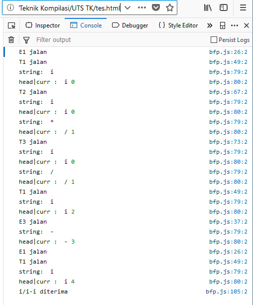
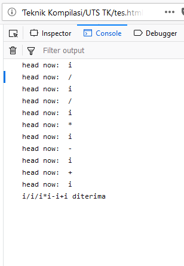

# Top Down Parsing with Brute Force & Recursive Descent Parsing

The matrix will automatically filled the outer border incrementally starting from designated point. This repository is archived from the 5th-semester group project on the compilation techniques course, Sriwijaya University.

## Members:

* Kanda Januar Miraswan (Lecturer) - [LinkedIn](https://www.linkedin.com/in/kandajm/), [Scholar](https://scholar.google.com/citations?user=4Bwuql8AAAAJ&hl=en)
* Dwi Novitasari [Instagram](https://www.instagram.com/dwinovi.s/)
* Muhammad Irfan Triananto Putra - [LinkedIn](https://www.linkedin.com/in/trianantoputra/)


## Getting Started

These instructions will get you a copy of the project up and running on your local machine for development and testing purposes. The program is made with Javascript programming language.

### Prerequisites

What things you need to install the software

* Local server - [XAMPP](https://www.apachefriends.org/index.html), etc.
* Browser - [Google Chrome](https://www.google.com/chrome/), [Firefox](https://www.mozilla.org/en-US/firefox/new/), etc.

### Running the tests

* open the XAMPP, run Apache.
* the user manually change the script in the html line 10 depending on what type of parsing to be used.
* the user can use brute force parsing (bfp.js) or recursive decent parsing (rdp.js), use one of the following:

```
<script type="text/javascript" src="rdp.js"></script> // if using rdp

<script type="text/javascript" src="bfp.js"></script> // if using bfp
```

* open index.html on the browser
* right click on the browser and "inspect element"
* click on "console" tab

### Input

* Manually type the input from the source code (bfp.js / rdp.js) on the variable "string"

```
string = "i/i/i*i-i+i"
```

### Output

* The output located in the "console" tab

#### Sample output brute force parsing

<p align="center">
  
</p>

#### Sample output recursive descent parsing

<p align="center">
  
</p>

## Documentation
* Generate Doppler Effect Pattern Matrix with Recursive, [Irfan, 2017](https://github.com/trianantoputra/doppler-effect-pattern/blob/master/Generate%20Doppler%20Effect%20Pattern%20Matrix%20with%20Recursive.pdf)